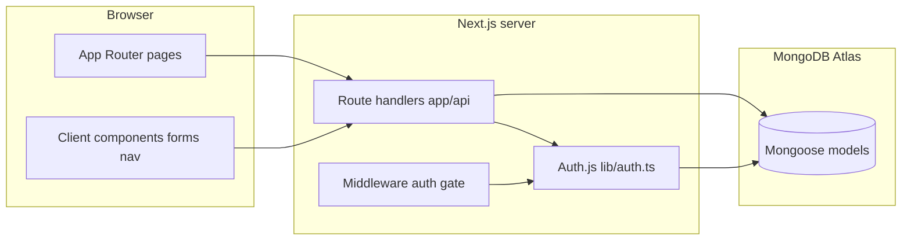

<!-- efb2a881-119b-491c-87bf-75a3375b48c4 -->
---
todos:
  - id: "scaffold"
    content: "Scaffold Next.js 14 + Tailwind in repo root; deps; mongodb.ts; middleware; health + PM2 config"
    status: pending
  - id: "models-auth"
    content: "Implement Mongoose models (indexes), lib/auth.ts, NextAuth route, register route, login/register pages"
    status: pending
  - id: "clients-api-ui"
    content: "Clients GET/POST + [id] GET/PATCH/DELETE; ClientForm; new/edit pages; dashboard list with search/filter/sort + ClientCard"
    status: pending
  - id: "rides-insights"
    content: "Rides API routes + RideLogForm + ride new page; Book Again prefill; client detail sections + insights lib"
    status: pending
  - id: "earnings-nav"
    content: "GET /api/rides/summary; earnings page; BottomNav; profile placeholder; root redirect"
    status: pending
  - id: "polish-docs"
    content: "globals/tailwind a11y pass; README + .env.example; npm run build verification"
    status: pending
isProject: false
---
# HUM Client Book — 48h MVP implementation plan

## Current state

The repo at [`/home/bigpoppacode/code/obelisk/hum-client-book`](/home/bigpoppacode/code/obelisk/hum-client-book) currently contains only [`RTTPOC_BUILD_PROMPT.md`](/home/bigpoppacode/code/obelisk/hum-client-book/RTTPOC_BUILD_PROMPT.md). Everything else will be created from scratch **in this directory** (use `create-next-app` with `.`, not a nested `hum-client-book/` folder).

## Architecture (high level)

- **Auth**: Auth.js v5 via `next-auth@beta` — Credentials provider, **JWT strategy**, `jwt` + `session` callbacks embedding `user.id`. Handlers exported from [`app/api/auth/[...nextauth]/route.ts`](/home/bigpoppacode/code/obelisk/hum-client-book/app/api/auth/[...nextauth]/route.ts). Wrapper `auth()` used in API routes and (where needed) server components.
- **DB**: Cached `connectDB()` in [`lib/mongodb.ts`](/home/bigpoppacode/code/obelisk/hum-client-book/lib/mongodb.ts); all queries scoped by `userId` from session.
- **Route protection**: [`middleware.ts`](/home/bigpoppacode/code/obelisk/hum-client-book/middleware.ts) redirects unauthenticated users from `/dashboard/*` to `/login`. Root [`app/page.tsx`](/home/bigpoppacode/code/obelisk/hum-client-book/app/page.tsx) redirects to `/dashboard` or `/login` based on session.
- **Static vs dynamic API segment**: Place earnings summary at [`app/api/rides/summary/route.ts`](/home/bigpoppacode/code/obelisk/hum-client-book/app/api/rides/summary/route.ts) so `summary` is not captured by [`app/api/rides/[id]/route.ts`](/home/bigpoppacode/code/obelisk/hum-client-book/app/api/rides/[id]/route.ts).

## Phase 1 — Scaffold and config

1. **Initialize** (non-interactive): `npx create-next-app@14 . --typescript --tailwind --eslint --app --no-src-dir --import-alias "@/*"`.
2. **Dependencies**: `mongoose`, `next-auth@beta`, `bcryptjs`; dev: `@types/bcryptjs`.
3. **Env template**: Document `.env.local` keys `MONGODB_URI`, `NEXTAUTH_SECRET`, `NEXTAUTH_URL` (README + optional `.env.example`).
4. **Tailwind / globals**: Extend theme (primary palette, min tap sizes), `text-base` ≥16px on inputs, safe-area padding utilities in [`app/globals.css`](/home/bigpoppacode/code/obelisk/hum-client-book/app/globals.css) for notched devices.
5. **Production extras**: [`ecosystem.config.js`](/home/bigpoppacode/code/obelisk/hum-client-book/ecosystem.config.js) per spec; [`app/api/health/route.ts`](/home/bigpoppacode/code/obelisk/hum-client-book/app/api/health/route.ts) returning `{ status: "ok" }`.

## Phase 2 — Mongoose models

Create [`models/User.ts`](/home/bigpoppacode/code/obelisk/hum-client-book/models/User.ts), [`models/Client.ts`](/home/bigpoppacode/code/obelisk/hum-client-book/models/Client.ts), [`models/Ride.ts`](/home/bigpoppacode/code/obelisk/hum-client-book/models/Ride.ts) with:

- Fields exactly as in the spec (including `group` enum, `tags[]`, `defaultRate`, ride `date` + locations + `fare`).
- **Indexes**: Client `{ userId: 1, name: 1 }`, `{ userId: 1, phone: 1 }`; Ride `{ clientId: 1, date: -1 }`, `{ userId: 1, date: -1 }`.
- Export TypeScript types from schemas (`InferSchemaType` or explicit interfaces) — avoid `any`.

## Phase 3 — Authentication

- **[`lib/auth.ts`](/home/bigpoppacode/code/obelisk/hum-client-book/lib/auth.ts)**: NextAuth config with Credentials provider: `connectDB`, find user by email, `bcrypt.compare`, issue JWT with `sub`/custom claims; `session` callback exposes `session.user.id`; `maxAge` ~7 days for JWT.
- **[`app/api/auth/[...nextauth]/route.ts`](/home/bigpoppacode/code/obelisk/hum-client-book/app/api/auth/[...nextauth]/route.ts)**: `export const { GET, POST } = handlers`.
- **[`app/api/auth/register/route.ts`](/home/bigpoppacode/code/obelisk/hum-client-book/app/api/auth/register/route.ts)**: Validate input, unique email, `bcrypt.hash` (10 rounds), create User — **no** password in response/logs.
- **Pages**: [`app/(auth)/login/page.tsx`](/home/bigpoppacode/code/obelisk/hum-client-book/app/(auth)/login/page.tsx), [`app/(auth)/register/page.tsx`](/home/bigpoppacode/code/obelisk/hum-client-book/app/(auth)/register/page.tsx) — client components for `signIn` / `fetch` register; **44px+** controls; fixed primary action on mobile; link between pages; accessible labels and error regions (`role="alert"` where appropriate).
- **Logout**: header/action on dashboard or profile placeholder calling `signOut({ callbackUrl: '/login' })`.

## Phase 4–5 — Clients API + list experience

**Shared API guard**: Small helper (e.g. [`lib/api-auth.ts`](/home/bigpoppacode/code/obelisk/hum-client-book/lib/api-auth.ts)) that calls `auth()`, returns `userId` or `401` JSON — use in every route except `register`, `[...nextauth]`, and `health`.

- **[`app/api/clients/route.ts`](/home/bigpoppacode/code/obelisk/hum-client-book/app/api/clients/route.ts)**  
  - **POST**: Validate body (name 1–100, phone regex, optional email, tags, group required); set `userId` from session.  
  - **GET**: Query params `search`, repeated `tags`, `group`, `sort` (`newest` | `rides` | `alphabetical` | `revenue`). Use aggregation `$lookup` rides filtered by `userId` to compute **ride count** and **total revenue** per client; apply filters in `$match`; sort in pipeline or in-memory only if simpler for MVP (prefer DB sort for performance at 50–200 clients).

- **Dashboard home** [`app/dashboard/page.tsx`](/home/bigpoppacode/code/obelisk/hum-client-book/app/dashboard/page.tsx): Client component shell: [`components/SearchBar.tsx`](/home/bigpoppacode/code/obelisk/hum-client-book/components/SearchBar.tsx), [`components/FilterChips.tsx`](/home/bigpoppacode/code/obelisk/hum-client-book/components/FilterChips.tsx), sort control, list of [`components/ClientCard.tsx`](/home/bigpoppacode/code/obelisk/hum-client-book/components/ClientCard.tsx). Debounce search (~200ms) to meet “instant” feel without thrashing. Empty state + FAB/link to `/dashboard/clients/new`. **Row height ≥60px**, tap navigates to detail.

## Phase 6 — Client detail

- **[`app/api/clients/[id]/route.ts`](/home/bigpoppacode/code/obelisk/hum-client-book/app/api/clients/[id]/route.ts)**: GET/PATCH/DELETE with ownership check (`userId` match); PATCH validates same rules as create.
- **[`app/dashboard/clients/[id]/page.tsx`](/home/bigpoppacode/code/obelisk/hum-client-book/app/dashboard/clients/[id]/page.tsx)**: Load client + rides (`GET /api/rides?clientId=` or parallel fetches). Sections: header + edit (navigate to edit page or inline modal — **minimal approach**: dedicated edit route **or** PATCH from detail with small sections to avoid scope creep), contact `tel:`/`mailto:` as large buttons, tags editor (dialog/sheet), insights grid (compute from ride dates/fares with safe handling for 0 rides), notes + preferences PATCH, ride history list, **Log Ride** CTA.
- **Insights logic**: Pure functions in e.g. [`lib/insights.ts`](/home/bigpoppacode/code/obelisk/hum-client-book/lib/insights.ts) (frequency, avg fare, total, regularity label) — unit-testable, no magic strings scattered in UI.

## Phase 7–8 — Rides + Book Again

- **[`app/api/rides/route.ts`](/home/bigpoppacode/code/obelisk/hum-client-book/app/api/rides/route.ts)**: POST verifies client belongs to user; GET supports `clientId` and optional period filters if needed for reuse; validate fare as number, date parsing.
- **[`app/api/rides/[id]/route.ts`](/home/bigpoppacode/code/obelisk/hum-client-book/app/api/rides/[id]/route.ts)**: GET/PATCH/DELETE with ownership via ride’s `userId` or joined client check.
- **[`components/RideLogForm.tsx`](/home/bigpoppacode/code/obelisk/hum-client-book/components/RideLogForm.tsx)**: Used from [`app/dashboard/clients/[id]/rides/new/page.tsx`](/home/bigpoppacode/code/obelisk/hum-client-book/app/dashboard/clients/[id]/rides/new/page.tsx) (or similar) with query params `prefillPickup`, `prefillDropoff`, optional fare from `defaultRate` — **Book Again** uses Next.js `Link` or router push with searchParams; **focus fare input** on mount when prefilled route.
- Success: redirect back to client detail with **toast** — implement lightweight `components/Toast.tsx` + context or sessionStorage flash to avoid extra dependencies (or minimal `sonner` if you prefer one dep — default plan: **no new UI lib**, simple state).

## Phase 9 — Earnings

- **[`app/api/rides/summary/route.ts`](/home/bigpoppacode/code/obelisk/hum-client-book/app/api/rides/summary/route.ts)**: `period=today|week|month|all`; compute date boundaries **Monday start week**, local timezone (document assumption in README); aggregate totals, avg, top client by sum of fares.
- **[`app/dashboard/earnings/page.tsx`](/home/bigpoppacode/code/obelisk/hum-client-book/app/dashboard/earnings/page.tsx)**: Period tabs (44px+), 2×2 summary cards, **optional chart placeholder** (empty state text) to stay within time; recent rides with link to client detail.

## Phase 10 — Layout + nav

- **[`app/dashboard/layout.tsx`](/home/bigpoppacode/code/obelisk/hum-client-book/app/dashboard/layout.tsx)**: Max-width ~640px centered, bottom padding for nav, include [`components/BottomNav.tsx`](/home/bigpoppacode/code/obelisk/hum-client-book/components/BottomNav.tsx) (56px+, 3 tabs: Clients, Earnings, Profile).
- **[`app/dashboard/profile/page.tsx`](/home/bigpoppacode/code/obelisk/hum-client-book/app/dashboard/profile/page.tsx)**: Placeholder + logout only (in scope per spec).

## Phase 11–13 — Quality, a11y, deploy docs

- Reusable primitives under [`components/ui/`](/home/bigpoppacode/code/obelisk/hum-client-book/components/ui/) (Button, Input, Label, Chip) to keep 44px sizing consistent.
- Visible focus rings, semantic headings, `aria-invalid` on errors.
- **[`README.md`](/home/bigpoppacode/code/obelisk/hum-client-book/README.md)**: Overview, env vars, dev commands, API table (routes + auth requirements), Linode/PM2/NGINX/Certbot notes (from spec).
- Run `npm run build` before completion; fix TypeScript strict issues.

## Implementation choices (explicit)

| Topic | Decision |
|-------|----------|
| Data from dashboard pages | Prefer **authenticated `fetch` to `/api/*`** with `credentials: 'include'` from client components for interactive pages; keeps one auth pattern and matches spec’s API-first wording. |
| Client add/edit | [`app/dashboard/clients/new/page.tsx`](/home/bigpoppacode/code/obelisk/hum-client-book/app/dashboard/clients/new/page.tsx) uses shared [`components/ClientForm.tsx`](/home/bigpoppacode/code/obelisk/hum-client-book/components/ClientForm.tsx); optional [`.../[id]/edit/page.tsx`](/home/bigpoppacode/code/obelisk/hum-client-book/app/dashboard/clients/[id]/edit/page.tsx) for “Edit” from detail (or inline PATCH sections only — pick **edit page** for clarity). |
| Pagination | MVP: scroll full list; **optional** note in README if 100+ rides per client becomes slow later. |
| Charts | plan for **placeholder** unless time remains; then add `recharts` minimal sparkline. |

## Risk notes

- **Auth.js v5** API differs from v4 — follow current `handlers` + `auth()` exports from package docs during implementation.
- **CORS**: same-origin app; no extra CORS for MVP unless a separate origin is introduced.
- **Linode**: No Vercel-only APIs (`@vercel/kv`, etc.).
